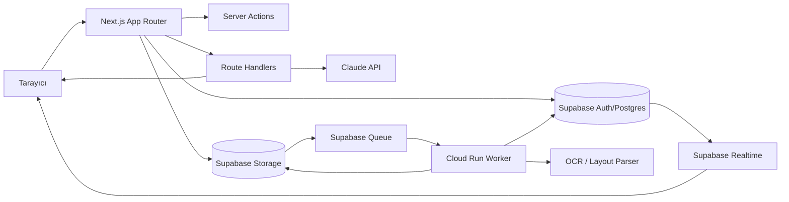
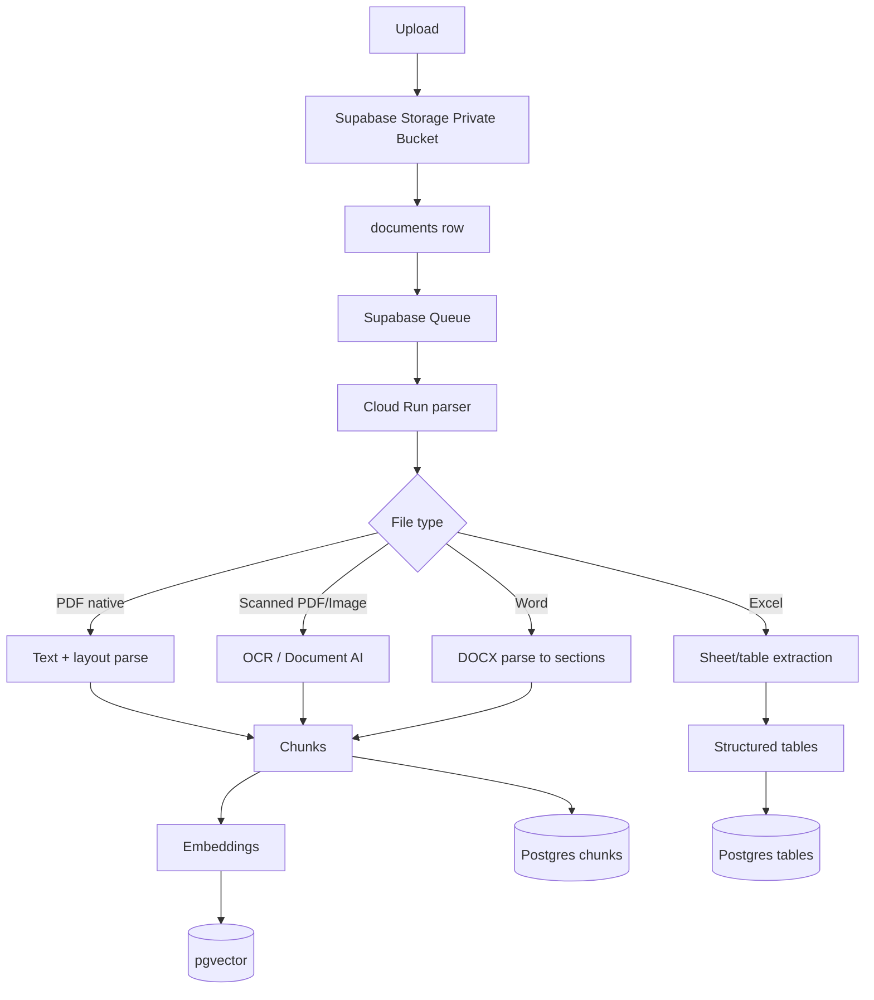
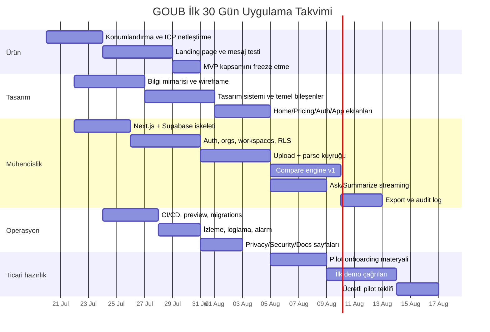

# GOUB İçin Uçtan Uca Web Ürün Spesifikasyonu ve Uygulama Planı

## Yönetici özeti

GOUB için en güçlü başlangıç noktası, “genel amaçlı AI doküman aracı”ndan önce ölçülebilir ekonomik değer üreten dar bir giriş MVP’sidir: **çoklu teklif/doküman karşılaştırma**. Bu özellik; yükleme, ayrıştırma, karşılaştırma, yönetici özeti, görev üretimi ve Excel/CSV dışa aktarma gibi sonraki iş akışlarının çoğunu doğal olarak gerektirir. Bu yüzden hem satışa uygun bir kama ürün olur, hem de sonradan “AI document workspace” katmanına genişlemek için doğru veri modelini ve boru hattını kurar. Bu raporun önerisi şudur: **MVP-1 = teklif/evrak karşılaştırma**, **MVP-2 = doküman üzerinde soru-cevap ve özet**, **MVP-3 = sözleşme inceleme, tablo çıkarma ve görev üretimi**. Bu kapsamı taşımak için Next.js App Router; Server/Client Components, Route Handlers, Server Actions ve streaming akışlarını destekler. Supabase ise tek yığında Postgres, Auth, Storage, RLS, REST, GraphQL, Realtime ve kuyruk yetenekleri sunar. Anthropic tarafında Claude Messages API, streaming, Files API, PDF desteği, tool use, prompt caching, token counting, rate limit başlıkları, veri yerleşimi ve veri saklama kontrolleri kurumsal ürün için yeterli bir temel sağlar. citeturn5search12turn0search1turn5search0turn13search0turn13search1turn13search3turn7search10turn14search0turn14search3turn4search1turn4search2turn10search11turn11search0turn11search2

Teknik olarak en doğru ayrım şudur: **Vercel/Next.js = kullanıcıya yakın web katmanı ve BFF**, **Supabase = veri/kimlik/depolama/izin katmanı**, **Cloud Run = ağır belge işleme işçileri**. Bu ayrım gereklidir; çünkü Supabase Edge Functions küresel edge üzerinde hafif TypeScript işleri için çok uygundur, fakat paket boyutu ve CPU sınırları nedeniyle LibreOffice tabanlı dönüştürme, çok sayfalı OCR, tablo normalizasyonu ve büyük ayrıştırma işlerini ana çalışma yüzeyi olarak taşımak için ideal değildir. Cloud Run ise tam konteyner çalıştırır, istek veya event ile tetiklenebilir ve sıfıra kadar ölçeklenir; bu yüzden belge işleme işçileri için daha doğru seçimdir. Supabase Queue/Database Webhooks ile işlerin dayanıklı kuyruğa alınması, Cloud Run worker’ların bunları tüketmesi ve sonuçların Postgres/Storage’a yazılması önerilir. citeturn13search2turn17search3turn17search7turn17search0turn17search4turn7search2turn7search10

AI katmanında varsayılan model olarak **Claude Sonnet 5**, ucuz sınıflandırma ve meta-etiketleme için **Claude Haiku 4.5**, istisnai karmaşık incelemeler için sınırlı **Claude Opus 4.8** önerilir. Anthropic’in resmi model karşılaştırması Sonnet 5’i hız/zeka dengesi için, Haiku 4.5’i hızlı ve ucuz işler için, Opus 4.8’i kompleks agentic/enterprise işler için konumlandırır. Claude’un prompt caching, tekrar eden sistem istemleri ve uzun bağlamlı belge iş akışlarında maliyeti ciddi biçimde düşürür; Batches API ise asenkron işlerde standart fiyatın yarısına iner, ancak Batch kullanımının ZDR uygunluğu ayrıca değerlendirilmelidir. Rate limit’ler model bazında RPM, ITPM ve OTPM olarak uygulanır; cached input token’ların çoğu modelde token-per-minute limitine sayılmaması, GOUB gibi belge-tekrarlı ürünlerde önemli bir performans/maliyet avantajıdır. citeturn20view0turn23view1turn23view2turn10search1turn10search2turn10search15turn16view0

Güvenlik ve mahremiyet tarafında tasarım ilkesi “**private by default**” olmalıdır: özel storage bucket’ları, signed URL erişimi, veri modelinde RLS, uygulama katmanında org/workspace üyelikleri, silme talepleri için Article 17 iş akışı, saklama politikaları için storage limitation ilkesi ve risk bazlı şifreleme/pseudonymisation kontrolleri. Supabase müşteri verisini AES-256 ile at-rest, TLS ile in-transit şifrelediğini; Vercel environment variable’ları at-rest şifreli tuttuğunu; Anthropic ise API ve veri saklama belgelerinde ZDR ile data residency seçenekleri sunduğunu açıkça belgeliyor. GDPR tarafında veri minimizasyonu, saklama süresinin sınırlanması, işleme güvenliği ve silme hakkı doğrudan ürün tasarımına yansıtılmalıdır. citeturn21search0turn7search9turn8search3turn11search0turn11search2turn15search3turn15search9turn15search7turn15search4

Ticari olarak GOUB’un ilk satış tezi “AI ile her belgeyi konuşulabilir hâle getirmek” değil, **“dokümanlardaki karşılaştırma ve özetleme yükünü dakikalar içinde azaltmak”** olmalıdır. Önerilen fiyatlandırma omurgası: ücretsiz deneme + kredi tabanlı sınır, ardından kullanıcı/ay veya workspace/ay paketleri; yüksek hacim için kullanım tabanlı ek sayfa/tokon ücretleri; kurumsalda SSO, saklama politikası, audit log ve özel entegrasyonlarla Enterprise. Başlangıç altyapı taban maliyeti çok düşüktür: Supabase Pro tabanı ayda 25 dolar, Vercel Pro tabanı ayda 20 dolar, Anthropic maliyeti kullanım bazlıdır ve tipik retrieval + caching deseninde bir “ask” çağrısı birkaç sent düzeyine indirilebilir; OCR maliyeti ise sayfa başına kuruş altı seviyede başlar ancak layout/parser kullanımıyla hızla artar. Bu nedenle ürün fiyatlaması **değer bazlı** olmalı, salt token-cost-plus modeli olmamalıdır. citeturn22view0turn27view0turn22view1turn23view1turn10search1turn2search12turn28calculator1turn28calculator2turn28calculator3

## Ürün stratejisi ve MVP kapsamı

GOUB’un ürün vizyonu, “belgeler ve iş akışları üzerinde çalışan, yüksek güvenliğe sahip, ekip-odaklı AI workspace” olarak tanımlanmalıdır. Kullanıcı bir PDF, Word, Excel veya taranmış belge yüklediğinde sistem yalnızca “özet üreten” bir bot gibi davranmamalı; belgeyi ayrıştırmalı, içinden yapılandırılmış veri çıkarmalı, karşılaştırmalı, riskli maddeleri işaretlemeli, görev üretmeli ve sonucu dışa aktarılabilir iş çıktısına dönüştürmelidir. Böylece GOUB, Chat arayüzüne sıkışmayan; **doküman + yapılandırılmış veri + aksiyon** üçlüsünü bir araya getiren bir ürün olur.

Başlangıç için en mantıklı kullanıcı segmentleri aşağıdaki gibidir:

| Hedef kullanıcı | Ana iş ihtiyacı | İlk satın alma gerekçesi | İlk ücretli özellik |
|---|---|---|---|
| Satın alma ekipleri | Çoklu tedarikçi tekliflerini kıyaslamak | Zaman tasarrufu + maliyet görünürlüğü | Fiyat/teslim/ödeme karşılaştırması |
| Operasyon ve back office ekipleri | PDF/Word/Excel evrakını normalize etmek | Tekrarlayan ofis işini azaltmak | Tablo çıkarma + özet |
| Hukuk ve sözleşme ekipleri | Kritik maddeleri ve riskleri bulmak | İlk taramayı hızlandırmak | Contract review + risk highlight |
| Ajanslar ve proje ekipleri | Toplantı notundan görev çıkarmak | Dağınık bilgiyi iş listesine çevirmek | Task generation + export |
| KOBİ yöneticileri | Evrak yükleyip “ne önemli?” diye sormak | Tek araçta cevap bulmak | Ask + summarize + export |

MVP kapsamı iki katmanda tasarlanmalıdır. İlk katman, satışı kolay olan “tek özellikli” giriş ürünüdür. İkinci katman ise aynı teknik omurga üstüne inşa edilen genişletilmiş GOUB workspace’tir.

| Kapsam | Dahil olan yetenekler | Neden öncelikli |
|---|---|---|
| Tek özellikli giriş MVP | Çoklu teklif yükleme, kalem eşleştirme, fiyat/teslim/ödeme karşılaştırma, fark işaretleme, yönetici özeti, Excel/CSV export | en somut ROI, en kolay satış anlatısı, en düşük belirsizlik |
| Genişletilmiş MVP | Ask, summarize, extract tables, contract review, task generation, share/export | kullanıcı başına kullanım sıklığını artırır |
| Sonraki yol haritası | klasör/workspace organizasyonu, entegrasyonlar, API, takım işbirliği, audit log, approval flows, template library | kurumsal satış ve genişleme için gerekli |

Altyapı seçimi açısından Supabase, Firebase ve Postgres+Hasura üçlüsü arasında GOUB için en dengeli seçimdir. Supabase; Postgres üzerinde RLS, Auth, Storage, Realtime, REST, GraphQL ve Functions/Queues ile belge odaklı SaaS için daha bütünleşik bir yığın sunar. Firebase; Security Rules ile güvenli olabilir ama Firestore’un operasyon okuma/yazma/indeks bazlı ücret modeli ve kural değerlendirmesi maliyeti doküman ağırlıklı, ilişkisel ve izinli veri tasarımlarında daha sürtünmeli olabilir. Hasura ise Postgres üzerinde çok güçlü GraphQL/REST katmanı sunar; ancak veri tabanı ve ek operasyonel katmanları ayrı yönetme maliyeti GOUB’un erken fazı için gereğinden ağırdır. Bu nedenle öneri: **Supabase-first, Hasura-not-now, Firebase-not-fit**. citeturn13search0turn13search1turn18search3turn26view0turn26view1turn25view0turn25view1turn19search0

| Ölçüt | Supabase | Firebase | Postgres + Hasura |
|---|---|---|---|
| Veri modeli | İlişkisel Postgres + `jsonb` + extension ekosistemi | NoSQL/Firestore | İlişkisel Postgres |
| Yetkilendirme | Postgres RLS | Security Rules | Hasura authz + Postgres |
| API | Auto REST + GraphQL + Realtime | SDK-first + Firestore API’leri | Instant GraphQL + REST |
| Dosya depolama | Storage + signed URL + RLS | Cloud Storage + Rules | Ayrı storage gerekir |
| Vektör arama | pgvector entegre | Harici çözüm gerekir | Postgres + pgvector ile mümkün |
| Erken faz operasyon yükü | Düşük | Düşük-orta | Orta-yüksek |
| GOUB’a uygunluk | Çok yüksek | Orta | Orta |

Tablodaki değerlendirme, Supabase’in auto-generated REST/GraphQL yaklaşımı, Postgres/RLS modeli, Storage ve vector desteği; Firebase’in Security Rules ve Firestore faturalaması; Hasura’nın instant GraphQL ve kaynak tüketimine dayalı fiyatlama belgeleri temel alınarak yapılmıştır. citeturn13search0turn13search1turn12search2turn26view0turn26view1turn25view0turn25view1

## UX, sayfa haritası ve kullanıcı deneyimi

GOUB’un UX’i iki ayrı ama bağlı yüzeyden oluşmalıdır: **pazarlama yüzeyi** ve **uygulama yüzeyi**. Pazarlama yüzeyi tek cümlede değer önermesini anlatmalı; uygulama yüzeyi ise yükle–sor–karşılaştır–çıkar–dışa aktar akışlarını mümkün olduğunca aynı zihinsel modelde toplamalıdır. Kullanıcı “araç koleksiyonu” görmemeli; “belgelerle çalışan workspace” görmelidir.

Önerilen ana alan adı yapısı:

| Alan | Amaç |
|---|---|
| `goub.net` | pazarlama sitesi |
| `app.goub.net` | uygulama |
| `docs.goub.net` | ürün ve API dokümantasyonu |
| `api.goub.net` | geliştirici/API giriş noktası |
| `status.goub.net` | servis sağlığı |

Pazarlama sayfaları için önerilen bilgi mimarisi ve örnek kopya aşağıdadır.

| Sayfa | Amaç | Örnek başlık | Alt metin | Ana CTA | İkincil CTA |
|---|---|---|---|---|---|
| Home | değer önermesi | **Get Out of Busywork.** | Belgeleri yükleyin, sorun, karşılaştırın, özetleyin ve çıktı alın. | Ücretsiz deneyin | Demo talep et |
| Pricing | planları netleştirmek | **Ekibiniz kadar esnek fiyatlama** | Küçük ekipten enterprise’a kadar sayfa, kullanım ve güvenlik temelli planlar. | Planları başlat | Satışla görüş |
| Docs | güven inşa etmek | **Nasıl çalıştığını açıkça görün** | Yükleme, veri işleme, dışa aktarma, API ve güvenlik akışları. | Dokümantasyonu aç | API erişimi iste |
| Auth | giriş ve kayıt | **Çalışmaya başlamak 60 saniye sürer** | Magic link, Google/Microsoft giriş veya SSO. | Magic link gönder | Google ile devam et |
| App Landing | iş alanına giriş | **Bugün neyi otomatikleştirelim?** | Belge yükleyin veya mevcut workspace’i açın. | Dosya yükle | Örnek dosyayı dene |

Home sayfası için önerilen kısa kopya:

> **GOUB**  
> **Get Out of Busywork.**  
> Teklifleri, sözleşmeleri, tabloları ve toplantı notlarını dakikalar içinde anlamlandıran AI doküman workspace’i.  
> **Buton:** İlk iş akışını ücretsiz otomatikleştir

Pricing sayfasının anlatısı, token veya model saymak yerine sonuç odaklı olmalıdır:

> **Starter**  
> Tek kişi veya küçük ekip için.  
> Yükleme, soru-cevap, özetleme ve temel export.

> **Pro**  
> Ekip çalışması ve karşılaştırma akışları için.  
> Çoklu belge karşılaştırma, görev üretimi, sınırlı entegrasyonlar.

> **Team / Enterprise**  
> SSO, veri saklama politikaları, audit log, özel entegrasyonlar ve SLA.

Uygulama içi ana kullanıcı akışları, tek merkezî “workspace” mantığında çözülmelidir.

| Akış | UX girişi | Arka planda olan | Başarı ölçütü |
|---|---|---|---|
| Upload | sürükle-bırak veya dosya seç | storage yükleme, metadata kaydı, parse iş kuyruğu | belge 2–30 sn içinde “işleniyor” durumuna geçer |
| Ask | belge görünümünde chat paneli | retrieval + Claude streaming yanıt | ilk token < 2 sn, kaynaklı yanıt |
| Compare | iki veya daha fazla belge seçimi | schema normalizasyonu + LLM eşleme | anlamlı fark tablosu |
| Summarize | “özetle” butonu | section-aware özet çıkarımı | yönetici özeti + madde madde öne çıkanlar |
| Extract tables | “tabloları çıkar” | tablo tespiti + normalizasyon | indirilebilir tablo veya sheet |
| Contract review | sözleşme şablonu seçimi | clause extraction + risk scoring | riskli maddeler renkli işaretlenir |
| Task generation | toplantı notu veya sözleşme üstünden | aksiyon, son tarih, sahip tespiti | görev listesi oluşur |
| Export | export drawer | CSV/XLSX/PDF/JSON üretimi | 1 tıkla indirilebilir çıktı |

Uygulama kabuğu için önerilen sol navigasyon:

| Sol menü öğesi | İçerik |
|---|---|
| Home | son aktiviteler, yüklemeler, önerilen iş akışları |
| Inbox | yeni yüklenen belgeler |
| Workspaces | ekip/klasör bazlı çalışma alanları |
| Documents | tüm belgeler ve filtreler |
| Compare | karşılaştırma işleri |
| Tasks | üretilmiş görevler |
| Exports | dışa aktarımlar ve geçmiş |
| Usage | kullanım ve kota |
| Settings | üyeler, güvenlik, API, faturalama |

UX ilkesinin özü şudur: kullanıcı her sayfada “bu belgeyle ne yapmak istiyorsun?” sorusuna bir tıkla ulaşmalıdır. Bu yüzden belge detay sayfasında üstte sabit bir “action rail” bulunmalıdır: **Sor**, **Özetle**, **Karşılaştır**, **Tablo çıkar**, **Risk tara**, **Görev üret**, **Dışa aktar**.

## Uygulama mimarisi ve Next.js tasarımı

Next.js tarafında öneri net biçimde **App Router** olmalıdır. Bunun nedeni yalnızca modern yönlendirme değil; Server Components ile veri çekimini sunucuda tutabilmek, Route Handlers ile BFF katmanı kurabilmek, Server Actions ile form/mutasyon akışlarını kolaylaştırabilmek ve streaming + Suspense ile belge işleme/AI cevaplarını daha hızlı hissettirebilmektir. Next.js belgeye göre Route Handlers `app` dizininde çalışır; Server Actions hem Server hem Client Components içinden çağrılabilir; ancak Server Functions doğrudan POST ile erişilebilir olduğundan her mutasyonda authz kontrolü sunucuda tekrar yapılmalıdır. Middleware de route koruma ve yönlendirme için faydalıdır ama tüm iş mantığını oraya taşımak doğru değildir. Supabase’in Next.js App Router ve SSR kılavuzları da cookie tabanlı SSR client yapısını destekler. citeturn0search1turn5search0turn5search4turn5search1turn18search0turn18search1turn18search2turn18search9



Önerilen klasör ve route grupları aşağıdaki gibi olmalıdır:

| Yol | Bileşen tipi | Amaç |
|---|---|---|
| `app/(marketing)/layout.tsx` | Server | pazarlama kabuğu |
| `app/(marketing)/page.tsx` | Server | home |
| `app/(marketing)/pricing/page.tsx` | Server | pricing |
| `app/(marketing)/docs/page.tsx` | Server | docs landing |
| `app/(auth)/login/page.tsx` | Server + küçük Client form | login |
| `app/(auth)/signup/page.tsx` | Server + küçük Client form | signup |
| `app/(auth)/callback/route.ts` | Route Handler | auth callback |
| `app/(app)/layout.tsx` | Server | korumalı uygulama kabuğu |
| `app/(app)/workspace/[slug]/page.tsx` | Server | workspace dashboard |
| `app/(app)/documents/page.tsx` | Server | belge listesi |
| `app/(app)/documents/[id]/page.tsx` | Server | belge detay görünümü |
| `app/(app)/compare/[jobId]/page.tsx` | Server | karşılaştırma görünümü |
| `app/(app)/tasks/page.tsx` | Server | görev merkezi |
| `app/(app)/exports/page.tsx` | Server | export geçmişi |
| `app/api/ask/route.ts` | Route Handler | Claude streaming BFF |
| `app/api/upload/init/route.ts` | Route Handler | signed upload init |
| `app/api/compare/route.ts` | Route Handler | compare iş başlatma |
| `app/api/export/route.ts` | Route Handler | export oluşturma |
| `middleware.ts` | Middleware | oturum yenileme + route gate |

Bileşen sınırları aşağıdaki ilkeye göre çizilmelidir:

| Katman | Server Component | Client Component |
|---|---|---|
| Veri okuma | evet | yalnızca interaktif filtre gerekiyorsa |
| Yetki kontrolü | evet | hayır |
| Büyük tablo ilk render | evet | hayır |
| Drag-drop upload | hayır | evet |
| Chat composer | hayır | evet |
| Streaming cevap görüntüleme | hayır | evet |
| Export tetikleme | çoğunlukla evet | ince etkileşim için evet |

Streaming tasarımında iki ayrı mekanizma kullanılmalıdır. Sayfa yükünde Next.js Suspense ile belge meta verisi ve yavaş paneller kademeli akmalıdır. AI cevaplarında ise Next Route Handler, Claude SSE akışını son kullanıcıya yeniden stream etmelidir. Anthropic’in streaming belgeleri SSE event akışı kullandığını net biçimde açıklar; Next.js de streaming ve Suspense’i App Router ile destekler. Bu kombinasyon, “belge geldi ama cevap bekliyorum” hissini azaltır. citeturn4search1turn4search4turn5search2turn5search8

BFF katmanında şu prensip önerilir: **kritik iş akışları daima Next Route Handlers üzerinden geçsin**. Bunun iki nedeni vardır. İlki, Claude anahtarlarını ve iş kurallarını tamamen sunucuda tutmak. İkincisi, rate limiting, audit, token budget ve redaction politikalarını tek yerden uygulamak. Supabase’in auto-generated REST/GraphQL yetenekleri çok değerlidir; ancak bunlar uygulama içi basit CRUD ve dashboard veri okumaları için kullanılmalı, AI ve belge işleme uçları için tek başına kamu API’si yapılmamalıdır. Supabase dokümantasyonu da REST/GraphQL uçlarının şemadan otomatik üretildiğini ve iki katmanlı veya üç katmanlı mimaride kullanılabildiğini açıkça belirtir. citeturn13search0turn13search1turn13search7

## Veri modeli, auth ve API tasarımı

GOUB veri modelinin ana omurgası; Supabase Auth’ın kimlik tablosunu, uygulama tarafı org/workspace üyeliklerini, belgeleri, belge versiyonlarını, chunk’ları, karşılaştırma işlerini, görevleri ve export nesnelerini bağlamalıdır. Postgres tarafında yarı-yapılandırılmış sonuçlar için `jsonb` tercih edilmelidir; çünkü PostgreSQL dokümantasyonuna göre `jsonb` depolanmış, ayrıştırılmış biçimi sayesinde çoğu erişimde `json`’a göre daha verimli ve indekslenebilir yapıdadır. Arama tarafında tam metin eşleme için PostgreSQL Full Text Search, semantik benzerlik için pgvector birlikte kullanılmalıdır. citeturn19search2turn19search1turn19search5turn7search4

### Önerilen çekirdek tablo seti

| Tablo | Ana sütunlar | İndeksler | Not |
|---|---|---|---|
| `profiles` | `id`, `email`, `full_name`, `avatar_url`, `locale`, `created_at` | PK(`id`) | `auth.users` ile 1:1 |
| `organizations` | `id`, `slug`, `name`, `plan`, `data_region`, `retention_days`, `created_at` | unique(`slug`) | tenant sınırı |
| `organization_members` | `org_id`, `user_id`, `role`, `status`, `joined_at` | unique(`org_id`,`user_id`), idx(`user_id`) | owner/admin/member vb. |
| `workspaces` | `id`, `org_id`, `slug`, `name`, `visibility`, `created_by`, `created_at` | unique(`org_id`,`slug`), idx(`org_id`) | ekip/kullanım alanı |
| `workspace_members` | `workspace_id`, `user_id`, `role` | unique(`workspace_id`,`user_id`) | ince yetki gerekiyorsa |
| `documents` | `id`, `org_id`, `workspace_id`, `title`, `source_filename`, `mime_type`, `storage_path`, `status`, `uploaded_by`, `created_at` | idx(`org_id`,`workspace_id`), idx(`status`) | ana belge kaydı |
| `document_versions` | `id`, `document_id`, `version_no`, `parse_status`, `page_count`, `language`, `checksum`, `created_at` | unique(`document_id`,`version_no`), idx(`parse_status`) | tekrar yükleme ve versiyon |
| `document_chunks` | `id`, `version_id`, `page_no`, `chunk_index`, `text`, `tsv`, `embedding`, `metadata` | idx(`version_id`,`page_no`), GIN(`tsv`), HNSW(`embedding`) | retrieval çekirdeği |
| `document_tables` | `id`, `version_id`, `page_no`, `table_index`, `title`, `headers`, `rows_json`, `csv_path`, `confidence` | idx(`version_id`,`page_no`) | tablo çıkarımı |
| `document_entities` | `id`, `version_id`, `entity_type`, `label`, `value_json`, `confidence` | idx(`version_id`,`entity_type`) | tarih, taraf, tutar vb. |
| `compare_jobs` | `id`, `org_id`, `workspace_id`, `created_by`, `status`, `mode`, `summary_json`, `created_at` | idx(`org_id`,`status`) | karşılaştırma işi |
| `compare_job_documents` | `compare_job_id`, `document_version_id`, `role` | unique(`compare_job_id`,`document_version_id`) | karşılaştırmadaki belgeler |
| `compare_items` | `id`, `compare_job_id`, `canonical_key`, `label`, `values_json`, `difference_type`, `severity` | idx(`compare_job_id`,`difference_type`) | satır satır farklar |
| `tasks` | `id`, `org_id`, `workspace_id`, `source_type`, `source_id`, `title`, `description`, `owner_user_id`, `due_date`, `status`, `created_at` | idx(`org_id`,`status`), idx(`owner_user_id`) | görev üretimi |
| `exports` | `id`, `org_id`, `workspace_id`, `source_type`, `source_id`, `format`, `status`, `storage_path`, `created_by`, `created_at` | idx(`org_id`,`status`) | indirilebilir çıktılar |
| `ai_runs` | `id`, `org_id`, `workspace_id`, `document_id`, `run_type`, `model`, `input_tokens`, `output_tokens`, `cached_input_tokens`, `latency_ms`, `status`, `created_at` | idx(`org_id`,`run_type`), idx(`created_at`) | maliyet, gözlenebilirlik |
| `audit_logs` | `id`, `org_id`, `actor_user_id`, `event_type`, `target_type`, `target_id`, `payload_json`, `created_at` | idx(`org_id`,`created_at`), idx(`event_type`) | güvenlik ve uyum |

Bu tablo tasarımı, Supabase’in RLS modeli, GraphQL/REST otomasyon yetenekleri, pgvector desteği ve vektör sorgularında RLS uygulanabilmesi göz önüne alınarak önerilmiştir. Supabase dokümantasyonu pgvector’ı Postgres içinde embedding saklama için; RAG-with-permissions kılavuzu ise vektör sorgularında RLS ile izinli retrieval için açıkça önerir. HNSW de Supabase’in kendi önerisinde varsayılan tercih olarak öne çıkar. citeturn18search3turn13search1turn7search4turn0search6turn7search0turn7search12

### RLS modeli

RLS’nin temel ilkesi şudur: **her sorgu org ve workspace bağlamında daralmalı, hiçbir tablo `public` için açık olmamalıdır**. Supabase, RLS’yi browser’dan veritabanına kadar savunma derinliği sağlayan temel mekanizma olarak konumlandırır. Ayrıca güncel performans notları, sadece `auth.uid()` kontrolüyle anon kullanıcıyı elemenin yeterli olmadığını; politikaların `authenticated` rolüne açıkça sınırlandırılmasını önerir. citeturn18search3turn18search6turn19search0

Önerilen ana roller:

| Rol | Yetki |
|---|---|
| `owner` | tüm org ayarları, faturalama, silme, retention |
| `admin` | üye yönetimi, workspace oluşturma, entegrasyon |
| `editor` | belge yükleme, ask, compare, export, task create |
| `reviewer` | contract review, compare onay, task update |
| `viewer` | görüntüleme ve export indirme |

Örnek RLS politikası mantığı:

```sql
create policy "org members can read organizations"
on public.organizations
for select
to authenticated
using (
  exists (
    select 1
    from public.organization_members m
    where m.org_id = organizations.id
      and m.user_id = auth.uid()
      and m.status = 'active'
  )
);
```

```sql
create policy "workspace docs readable by workspace members"
on public.documents
for select
to authenticated
using (
  exists (
    select 1
    from public.workspace_members wm
    where wm.workspace_id = documents.workspace_id
      and wm.user_id = auth.uid()
  )
);
```

```sql
create policy "editors can insert documents"
on public.documents
for insert
to authenticated
with check (
  exists (
    select 1
    from public.workspace_members wm
    where wm.workspace_id = documents.workspace_id
      and wm.user_id = auth.uid()
      and wm.role in ('owner','admin','editor')
  )
);
```

### Auth, roller ve takım yapısı

Supabase Auth, magic link, OTP, sosyal giriş ve SAML tabanlı enterprise SSO’yu destekler. Next.js App Router tarafında `@supabase/ssr` ile cookie tabanlı SSR oturumu kullanılmalıdır. GOUB bunu iki seviyede kullanmalıdır: kimlik doğrulama Supabase tarafından; org/workspace üyeliği ise public şemadaki uygulama tabloları tarafından yönetilmelidir. Böylece ürün rol modeli, Auth sağlayıcı bağımsız kalır. Magic link self-serve kullanıcılar için; Google/Microsoft OAuth orta pazarda; SAML SSO ise enterprise planı için açılmalıdır. citeturn18search16turn1search8turn7search11turn7search3turn18search0turn18search1

### API yaklaşımı

GOUB için doğru API deseni **REST-first BFF + selective GraphQL** modelidir. Kullanıcı etkileşimli iş akışları için Next Route Handlers üzerinden REST uçları daha denetlenebilir olur. Admin panelleri, düşük riskli CRUD ve iç raporlamada ise Supabase GraphQL kullanılabilir.

| Endpoint | Method | Auth | Amaç |
|---|---|---|---|
| `/api/upload/init` | `POST` | editor+ | signed upload başlat |
| `/api/upload/complete` | `POST` | editor+ | metadata ve parse job oluştur |
| `/api/ask` | `POST` | viewer+ | belgeye soru sor, streaming yanıt |
| `/api/summarize` | `POST` | viewer+ | özet üret |
| `/api/compare` | `POST` | editor+ | compare job başlat |
| `/api/compare/:id` | `GET` | viewer+ | compare sonucu getir |
| `/api/extract-tables` | `POST` | editor+ | tablo çıkarma başlat |
| `/api/contract-review` | `POST` | reviewer+ | risk taraması başlat |
| `/api/tasks/generate` | `POST` | editor+ | görev üret |
| `/api/exports` | `POST` | viewer+ | export üret |
| `/api/exports/:id` | `GET` | viewer+ | export durumu ve indirme |
| `/api/webhooks/storage-finalized` | `POST` | internal | storage event al |
| `/api/webhooks/stripe` | `POST` | internal | faturalama senkronizasyonu |

Bu yaklaşım, Next Route Handlers ve Supabase’in otomatik REST/GraphQL yüzleri birlikte kullanılarak en pratik şekilde uygulanabilir. Supabase dokümanları hem REST’in tarayıcıdan doğrudan hem de üç katmanlı sunucu mimarisiyle kullanılabildiğini; GraphQL’in de şemadan otomatik üretildiğini söylüyor. citeturn0search1turn13search0turn13search1

Örnek istek/yanıtlar:

```json
POST /api/upload/init
{
  "workspaceId": "ws_123",
  "filename": "teklif-a.pdf",
  "mimeType": "application/pdf",
  "sizeBytes": 2849201
}
```

```json
200 OK
{
  "documentId": "doc_123",
  "uploadUrl": "SIGNED_URL",
  "storagePath": "org_1/ws_123/doc_123/v1/original.pdf",
  "expiresIn": 600
}
```

```json
POST /api/ask
{
  "workspaceId": "ws_123",
  "documentIds": ["doc_123"],
  "question": "Teslim süresi ve ödeme koşulları nedir?",
  "mode": "grounded"
}
```

```json
200 OK
{
  "stream": true,
  "runId": "run_987"
}
```

```json
POST /api/compare
{
  "workspaceId": "ws_123",
  "documentVersionIds": ["dv_1", "dv_2", "dv_3"],
  "schema": "supplier_quote_v1",
  "outputFormat": "table"
}
```

```json
202 Accepted
{
  "compareJobId": "cmp_456",
  "status": "queued"
}
```

GraphQL tarafında örnek bir sorgu:

```graphql
query WorkspaceDocuments($workspaceId: UUID!) {
  workspacesCollection(filter: { id: { eq: $workspaceId } }) {
    edges {
      node {
        id
        name
        documentsCollection(orderBy: [{ createdAt: DescNullsLast }], first: 20) {
          edges {
            node {
              id
              title
              status
              createdAt
            }
          }
        }
      }
    }
  }
}
```

## AI, belge işleme ve arka plan pipeline

Anthropic entegrasyonunda GOUB için en sağlıklı model matrisi aşağıdaki gibidir:

| Kullanım | Önerilen model | Gerekçe |
|---|---|---|
| Varsayılan belge soru-cevap | Claude Sonnet 5 | kalite/hız/fiyat dengesi |
| Basit sınıflandırma, dil tespiti, meta etiketleme | Claude Haiku 4.5 | hızlı ve ucuz |
| Karmaşık sözleşme inceleme, düşük güvenli istisnalar | Claude Opus 4.8 | daha yüksek muhakeme |
| İkinci sağlayıcı fall-back | OpenAI GPT-5.6 Terra | çok sağlayıcılı dayanıklılık seçeneği |

Anthropic’in resmi model karşılaştırması Sonnet 5’i “speed and intelligence” dengesi için, Haiku 4.5’i en hızlı model olarak, Opus 4.8’i kompleks agentic ve enterprise işler için öneriyor. OpenAI tarafında da resmi model seçimi rehberi Terra’yı zeka/maliyet dengesi için konumluyor. GOUB için ticari ve teknik denge açısından Anthropic-primary + OpenAI-fallback yaklaşımı mantıklıdır; fakat müşteri sözleşmesi gerektirmedikçe MVP aşamasında çok sağlayıcılı soyutlama katmanı eklemek gereksiz karmaşıklık yaratır. citeturn20view0turn24view0turn22view2

| Model | Sağlayıcı | Yaklaşık konumlandırma | Girdi/çıktı fiyatı | Uygun kullanım |
|---|---|---|---|---|
| Claude Sonnet 5 | Anthropic | varsayılan üretim modeli | geçici intro: $2 / $10 MTok; standart: $3 / $15 MTok | ask, summarize, compare |
| Claude Haiku 4.5 | Anthropic | ucuz/hızlı yardımcı model | $1 / $5 MTok | classification, routing |
| Claude Opus 4.8 | Anthropic | yüksek yetenekli escalation | $5 / $25 MTok | complex review |
| GPT-5.6 Terra | OpenAI | fallback dengeli model | short-context priority: $5 / $30 MTok; flex daha düşük | vendor fallback |

Bu tablo Anthropic ve OpenAI’nin resmi model/pricing sayfalarına göre oluşturulmuştur. Anthropic tarafında Batch fiyatları standart fiyatın %50’si düzeyine iner; prompt caching de cache hit tarafında fiyatı önemli ölçüde aşağı çeker. citeturn23view1turn23view2turn10search1turn24view0turn22view2

### Claude entegrasyon deseni

GOUB’da Claude entegrasyonu üç desene ayrılmalıdır.

İlk desen, **interactive streaming**’dir. Kullanıcı soru sorduğunda Next Route Handler, belge retrieval sonucunu Claude Messages API’ye gönderir ve SSE akışını tarayıcıya iletir. Anthropic’in TypeScript SDK’sı ve streaming belgeleri bu akışı doğrudan destekler. Bu akış tüm “Ask” ve “Summarize” deneyimlerinin varsayılanı olmalıdır. citeturn4search4turn4search1turn4search5

İkinci desen, **tool-assisted generation**’dır. Claude’un tool use özelliği sayesinde model; export oluşturma, görev kaydetme, karşılaştırma sonucu çağırma gibi işlemler için tanımlı sunucu araçlarını çağırabilir. Ancak GOUB’da tool execution tamamen sunucu tarafında tutulmalıdır; model yalnızca structured intent döndürmeli, gerçek yan etkiyi uygulama çalıştırmalıdır. Anthropic tool use dokümanları tam da bu client/server araç ayrımını tarif eder. citeturn4search2turn4search15turn10search17

Üçüncü desen, **async batch/offline processing**’dir. Büyük miktarda gece çalışacak özetler, çok sayıda export veya doküman yeniden indeskleme işlerinde Anthropic Batch API maliyeti yarıya indirir. Ancak Anthropic özellik özetinde batch’in ZDR uygunluğu ayrıca not düşüldüğü için, hassas müşteri verisi üzerinde bu mod varsayılan olmamalıdır. GOUB’de kural şu olmalıdır: **interactive ve hassas akışlar = normal Messages API**, **gece işleri ve hassas olmayan toplu işler = Batch API**. citeturn10search2turn10search15turn11search0

### Prompt şablonları

Anthropic, karmaşık istemlerde XML tag’leri açıkça tavsiye ediyor. GOUB için tüm sistem istemleri sürümlü prompt template olarak saklanmalıdır.

Örnek sistem şablonu:

```xml
<role>
You are GOUB, an AI document workspace assistant for business documents.
</role>

<objective>
Answer only from the provided sources and structured retrieval results.
If information is uncertain or missing, say so clearly.
</objective>

<policy>
Never invent contract clauses, prices, deadlines, or obligations.
Always separate extracted facts from inference.
Return citations to chunk_ids when available.
</policy>

<output_format>
Return:
1. short_answer
2. evidence
3. risks
4. suggested_actions
</output_format>
```

Karşılaştırma şablonu:

```xml
<task>
Normalize multiple supplier quotes into one canonical comparison table.
</task>

<canonical_schema>
item_name, unit, quantity, unit_price, total_price, delivery_time, payment_terms, warranty, notes
</canonical_schema>

<rules>
- Preserve uncertainty explicitly
- Do not merge rows unless semantic match is strong
- Flag missing fields as null
- Return structured JSON only
</rules>
```

Anthropic’in prompt engineering dokümanları XML tag’lerle yapılandırmayı, çok bileşenli prompt’larda belirsizliği azaltmak için özellikle önerir. citeturn4search0turn4search3

### Safety, rate limits ve bütçe kontrolü

Claude tarafında üç kontrol zorunlu olmalıdır. Birincisi, **token counting** ile istek gönderilmeden önce giriş büyüklüğünü tahminlemek. İkincisi, **prompt caching** ile sabit system prompt, tool schema ve belge özetlerini cache’lemek. Üçüncüsü, **rate limit-aware scheduler** ile RPM/ITPM/OTPM bütçelerine göre kuyruklama yapmak. Anthropic rate limit belgeleri, yanıt başlıklarında kalan limitleri ve reset zamanını verdiğini; ayrıca cache read token’ların çoğu modelde ITPM’e sayılmadığını açıkça söylüyor. Bu, GOUB gibi tekrar eden bağlamı olan uygulamalarda doğrudan operasyonel avantajdır. citeturn10search11turn10search1turn16view0

### Belge işleme boru hattı

GOUB’un belge işleme akışı deterministik katmanlar ve LLM katmanlarının birleşimi olmalıdır. Önerilen sıra şöyledir:

1. Dosyayı private Supabase bucket’a yaz.  
2. `documents` ve `document_versions` kaydını oluştur.  
3. Queue’ya parse işi yaz.  
4. Cloud Run worker dosyayı indirip MIME ve kaynak tipini doğrulasın.  
5. Metin tabanlı PDF/Office belgelerde önce native parser çalışsın.  
6. Taranmış PDF/görüntü belgesi ise OCR/layout parser devreye girsin.  
7. Sayfalar, tablolar, chunk’lar ve entity’ler normalize edilip Postgres’e yazılsın.  
8. Chunk embedding üret ve vector index’e kaydet.  
9. Parse sonucu Realtime veya polling ile UI’a geri bildirilsin.



Dosya tipi bazında önerilen yaklaşım:

| Dosya tipi | Birincil strateji | İkincil strateji | Neden |
|---|---|---|---|
| Metin tabanlı PDF | native text extraction + layout parse | Claude PDF support sayfa düzeyi yorum | daha ucuz ve deterministik |
| Taranmış PDF | OCR/layout parser | sayfa bazlı Claude görsel yorum | görüntü tabanlı içerik için gerekli |
| DOCX | metin ve heading parse | dönüştürülmüş HTML/markdown | sözleşme ve tekliflerde yapı korunur |
| XLSX | sheet/cell/table parse | LLM ile kolon standardizasyonu | kıyas işleri için en önemli format |
| Görüntü | OCR + sınıflandırma | Claude vision/PDF mode | fiş, tarama, fotoğraf doküman |

Anthropic’in PDF desteği, PDF içindeki metin, tablo, grafik ve görselleri işleyebildiğini; Files API de dosyaları her çağrıda yeniden yüklemeden kullanmayı mümkün kıldığını belirtir. Buna rağmen GOUB’un “source of truth” katmanı alan-normalize edilmiş kendi parse kaydı olmalıdır; çünkü görev üretimi, compare tablosu ve export işlerinde deterministik yapı gerekir. Claude PDF desteği en iyi, “native parser’ın zorlandığı sayfalarda ikinci göz” olarak kullanılır. citeturn14search0turn14search3turn14search1

### OCR ve tablo çıkarma seçenekleri

| Servis | Resmî konumlandırma | Tablolar/layout | Fiyat sinyali | GOUB önerisi |
|---|---|---|---|---|
| Google Document AI | OCR + layout + parser ailesi | güçlü | OCR $1.50/1000 sayfa; Layout Parser $10/1000 sayfa | birincil managed OCR adayı |
| AWS Textract | OCR + forms/tables/queries | güçlü | tablo/forms/queries kombinasyonları sayfa bazlı fiyatlanır | AWS ağırlıklı müşteri varsa alternatif |
| Azure Document Intelligence | layout + OCR + prebuilt modeller | güçlü | read/layout/extraction sayfa bazlı | Azure müşterileri için alternatif |

Google Document AI resmi fiyatlandırması OCR ve layout parser’ı ayrı katmanlarda veriyor; Azure Document Intelligence layout tarafında tablo yapısını ve selection mark’ları çıkardığını belirtiyor; Textract da tables/forms/queries kombinasyonlarını ayrı fiyatlıyor. GOUB için öneri, ilk aşamada **Google Document AI veya eşdeğer tek bir managed OCR sağlayıcı** seçmek ve abstraction katmanını sadece worker içinde tutmaktır. Böylece ürün kodu sağlayıcı bağımlılığı hissetmez. citeturn2search12turn2search4turn2search0turn2search6turn2search2turn2search1

### Embedding ve retrieval stratejisi

Vektör veritabanı olarak ayrı bir harici servis yerine **Supabase pgvector** kullanılmalıdır. Sebep yalnızca basitlik değildir; asıl sebep vektör sorgularında RLS uygulanabilmesi ve vektörlerin aynı tenant-aware Postgres içinde tutulabilmesidir. Supabase vektör indekslerinde HNSW’yi genel tavsiye olarak öne çıkarır. Buna ek olarak sadece semantik arama yeterli değildir; GOUB’un “ödeme koşulu”, “teslim süresi”, “ceza maddesi” gibi exact-ish sorguları için `tsvector` tabanlı Full Text Search de paralel kullanılmalıdır. Doğru desen: **hybrid retrieval = BM25/FTS + vector + metadata filters**. citeturn7search4turn7search0turn7search12turn0search6turn19search1turn19search5

### Kuyruklar ve arka plan işleri

Supabase Queues, Postgres-native durable queue olarak ve guaranteed delivery vaadiyle gelir. GOUB bunu parse, embedding, compare, export ve nightly cleanup işlerinde kullanmalıdır. Sık çalışan zamanlanmış görevler için Vercel Cron veya Cloud Run scheduler kullanılabilir; ancak ağır iş yapan cron uçları doğrudan Next fonksiyonlarında uzun süre kalmamalıdır. citeturn7search10turn7search18turn0search3turn0search23

Arka plan iş tipleri:

| İş tipi | Worker | Tetikleyici |
|---|---|---|
| `parse_document` | Cloud Run | upload completion |
| `generate_embeddings` | Cloud Run | parse complete |
| `run_compare` | Cloud Run | user action |
| `generate_export` | Cloud Run | user action |
| `refresh_summaries` | Cloud Run / Batch | cron |
| `retention_cleanup` | Cron + worker | günlük |

## Operasyon, güvenlik, gizlilik ve maliyet

CI/CD için önerilen ana hat şudur: GitHub repo’ya push → GitHub Actions lint/test/typecheck → Supabase migration dry-run → Vercel preview deployment → review → production merge. Vercel, Git entegrasyonunda her branch push için Preview Deployment URL üretir; Supabase CLI ise lokal stack, migration, function deployment ve tür üretimi için uygundur. Bu nedenle şema değişiklikleri dashboard’dan “elle” değil, migration-first yürütülmelidir. citeturn8search0turn8search4turn8search5turn8search6turn8search10turn8search2

Önerilen CI/CD adımları:

| Aşama | Araç | Çıkış |
|---|---|---|
| Lint/typecheck/test | GitHub Actions + pnpm | yeşil build |
| DB migration validate | Supabase CLI | geri alınabilir migration |
| Preview deploy | Vercel Git integration | paylaşılabilir URL |
| Manual QA | preview ortamı | kabul/reddet |
| Production deploy | Vercel main merge | canlı sürüm |
| DB apply | Supabase migration pipeline | şema senkronu |

Gözlenebilirlikte minimum set; **yapılandırılmış JSON logları**, **request id/run id**, **Claude token ve latency ölçümü**, **job lifecycle metric’leri**, **hata oranı ve kuyruk bekleme süresi**, **parse success rate** ve **export success rate** olmalıdır. Vercel Runtime Logs ve Observability, web ve function katmanında bu iş için doğal başlangıç noktalarıdır. Cron ve runtime logları da Vercel tarafında izlenebilir. GOUB ayrıca uygulama seviyesinde `audit_logs` tablosu ve `ai_runs` tablosunu tutmalıdır; çünkü teknik log ile uyum/audit log aynı şey değildir. citeturn5search3turn5search6turn5search11turn0search7

Güvenlik tasarımı “public storage yok, signed URL var” ekseninde kurulmalıdır. Supabase Storage bucket’larında public/private modeli ve signed URL üretimi resmî olarak desteklenir. Bu, kullanıcı belgelerinin asla kalıcı public URL ile sunulmaması gerektiği anlamına gelir. Upload tarafında da mümkünse signed upload URL kullanılmalı; virüs taraması gerekiyorsa worker katmanına eklenmelidir. citeturn7search1turn7search9turn7search5

Kimlik ve uygulama güvenliğinde şu kararlar önerilir: self-serve katmanda magic link + OAuth; Team ve Enterprise’da SAML SSO; oturumlar SSR cookie ile yönetilsin; tüm veri erişimi RLS üzerinden yürüsün; admin yetkileri salt client-state ile değil sunucu policy’leriyle denetlensin; hassas secrets Vercel env ve gerekiyorsa Supabase Vault’ta tutulsun. Vercel environment variable’ları at-rest şifreli saklanır; Supabase de at-rest AES-256 ve in-transit TLS sağladığını açıkça belirtir. citeturn1search8turn7search11turn18search1turn18search3turn21search1turn8search3turn21search0

Anthropic tarafında gizlilik ve veri yerleşimi kararı ürüne açıkça yansıtılmalıdır. Anthropic API/data retention belgeleri ZDR ve retention modlarını, data residency belgeleri de `inference_geo` ve workspace geo kontrollerini tanımlar. Bu yüzden GOUB Enterprise’ta en azından iki mod sunmalıdır: **standart işleme** ve **hassas işleme**. Hassas işlemede Batch API devreye alınmamalı, data residency talebi olan müşteri için uygun inference geography kullanılmalı ve prompt redaction katmanı sıkılaştırılmalıdır. citeturn11search0turn11search2turn10search15

GDPR açısından ürün tasarımına doğrudan gömülmesi gereken ilkeler şunlardır: veri minimizasyonu, storage limitation, silme hakkı ve risk temelli güvenlik önlemleri. Article 5 veri minimizasyonu ve saklama sınırlamasını; Article 17 undue delay olmadan silme hakkını; Article 32 ise risk düzeyine uygun teknik ve organizasyonel önlemleri, özellikle encryption ve pseudonymisation gibi unsurları vurgular. GOUB bu yüzden org seviyesinde retention policy, export TTL, raw dosya saklama süresi, parsed chunk saklama süresi ve silme workflow’larını ürün ayarı olarak sunmalıdır. citeturn15search3turn15search9turn15search4turn15search7turn15search1

Önerilen saklama politikası örneği:

| Veri türü | Varsayılan süre | Gerekçe |
|---|---|---|
| Ham yüklenen dosya | 90 gün | tekrar açma ve export |
| Parse edilmiş chunk/tablo | 180 gün | search ve ask performansı |
| Chat ve AI cevap geçmişi | 90 gün | kullanıcı deneyimi |
| Audit log | 365 gün | güvenlik ve uyum |
| Soft delete bekleme süresi | 30 gün | kurtarma tamponu |
| Enterprise özel policy | sözleşmeye göre | müşteri uyumu |

### Maliyet tahmini ve önerilen fiyatlandırma

Altyapı taban maliyeti erken fazda düşüktür. Resmî tabanlar itibarıyla Supabase Pro ayda 25 dolar, Vercel Pro ayda 20 dolar ve Vercel’de 20 dolarlık kullanım kredisi ile gelir. Supabase Pro ayrıca 100K MAU, 8 GB disk, 250 GB egress ve dosya depolama limitleri içerir. Claude tarafında Sonnet 5’in giriş/çıkış fiyatı geçici intro döneminde daha düşüktür; Haiku 4.5 çok ucuz yardımcı modeldir. Document AI OCR ve Layout Parser sayfa başı çok düşükten başlayan ama feature bazlı artan bir fiyat yapısına sahiptir. citeturn22view0turn27view0turn22view1turn23view1turn2search12turn2search0

Kabaca üretim senaryoları:

| Senaryo | Varsayım | Aylık tahmin |
|---|---|---|
| Small beta | 10 ekip, 5K sayfa/ay, düşük yoğunluk | ~$100–$300 |
| Erken üretim | 50 ekip, 50K sayfa/ay, düzenli ask/compare | ~$500–$2,000 |
| Büyüyen SaaS | 200 ekip, 250K sayfa/ay, OCR ve export yoğun | ~$3,000+ |

Bu aralıklar; Supabase/Vercel taban ücretleri, sayfa-parsing/OCR ve Claude kullanımı birlikte düşünülerek verilmiştir. Maliyet dağılımını pratikte üç şey sürer: **işlenen sayfa sayısı**, **OCR oranı**, **Claude çağrılarında retrieval/caching disiplini**. Sonnet 5 ile retrieval ve cache hit kullanılan tipik bir “ask” çağrısı teorik olarak birkaç sent seviyesine inebilir; fakat compare ve contract review gibi daha uzun akışlarda maliyet katlanır. Bu yüzden ürün fiyatlaması için doğru yaklaşım, plan içinde belirli AI kredileri ve sayfa kotaları tanımlamaktır. citeturn22view0turn27view0turn23view1turn10search1turn28calculator1turn28calculator2turn28calculator3

Önerilen ticari paketleme:

| Plan | Hedef | İçerik |
|---|---|---|
| Free | deneme | sınırlı belge, sınırlı soru, watermark export |
| Starter | solo kullanıcı | ask, summarize, temel export |
| Pro | küçük ekip | compare, contract review, task generation |
| Team | operasyon ekipleri | workspace, roles, audit, daha yüksek kotalar |
| Enterprise | büyük müşteri | SSO, retention policy, custom region, SLA, private onboarding |

## Pazara çıkış, lansman planı ve riskler

GOUB’un ilk pazarlama anlatısı “AI belge aracı” değil, **“teklif ve evrak karşılaştırmasını dakikalara indiren iş workspace’i”** olmalıdır. Bu mesaj daha satış odaklıdır; because “özetliyor” ifadesinden daha kolay bütçe çıkarır. İlk GTM hareketi geniş yatay pazar değil, belge yoğun ama teknik entegrasyon eşiği düşük dikeyler olmalıdır: satın alma ekipleri, ajans operasyonları, inşaat/üretim teklif süreçleri ve KOBİ back office.

İlk 30 gün için uygulanabilir ticari hedefler:

| Hedef | Başarı tanımı |
|---|---|
| Konumlandırma netleşmesi | landing page’de tek ana vaadin sabitlenmesi |
| İlk pilotlar | 5–10 tasarım partneri |
| İlk gerçek veri | en az 100 gerçek doküman üzerinde parse/compare testleri |
| İlk ödeme sinyali | en az 2 ücretli pilot veya LOI |
| Güven dili | docs, privacy, retention ve security sayfalarının canlı olması |

İlk 90 gün için hedefler:

| Hedef | Başarı tanımı |
|---|---|
| Ürün-market sinyali | haftalık aktif kullanım gösteren 10+ ekip |
| İş akışı genişleme | compare dışı ask/summarize/task adoption |
| Dışa aktarım kalitesi | kullanıcıların son çıktıyı manuel düzenleme oranının düşmesi |
| Ekipli kullanım | org/workspace üyeliklerinin aktif kullanımı |
| Hukuk/ops varyantı | en az bir ikinci dikey için şablonlaştırılmış akış |



Başlıca riskler ve azaltımlar aşağıdaki gibidir:

| Risk | Etki | Azaltım |
|---|---|---|
| Parse doğruluğu düşük kalır | güven kaybı | deterministic parser + LLM ikinci aşama + insan doğrulama UI |
| OCR maliyeti patlar | marj daralır | native parse-first, OCR only-when-needed |
| Her use case’i aynı anda çözmeye çalışmak | ürün dağılır | compare-first kapsam disiplini |
| RLS ve üyelik modeli karmaşıklaşır | veri sızıntısı riski | org/workspace sınırlarını baştan normalize et |
| Claude maliyeti büyür | birim ekonomi bozulur | prompt caching, token counting, Haiku routing |
| Export kalitesi yetersiz olur | kullanıcı son adımı üründe tamamlamaz | XLSX/CSV/PDF formatlarını erken test et |
| Enterprise satışta güven eksikliği | satış döngüsü uzar | docs, privacy, retention, audit ve SSO roadmap’ini erken yayınla |
| Ağır worker’lar web katmanına sızar | performans ve stabilite bozulur | Cloud Run worker ayrımı, queue-backed processing |

Net öneri şudur: GOUB’u önce **yüksek ROI’li doküman karşılaştırma ürünü** olarak çıkarın; fakat veri modeli, retrieval, RLS, export ve AI orkestrasyonunu baştan **genişleyebilir workspace** mantığında kurun. Bu sayede pazarlanabilir ilk ürün ile uzun vadeli platform mimarisi arasında yeniden yazım gerektirmeyen bir köprü kurmuş olursunuz.